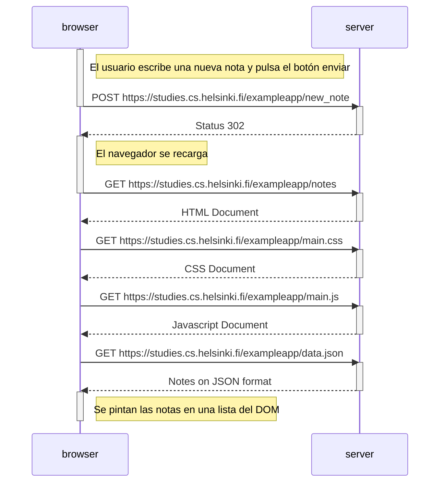

```mermaid
sequenceDiagram
    participant browser
    participant server

    activate browser
    Note right of browser: El usuario escribe una nueva nota y pulsa el botón enviar
    browser->>server: POST https://studies.cs.helsinki.fi/exampleapp/new_note
    deactivate browser

    activate server
    server-->>browser: Status 302
    deactivate server

    activate browser
    Note right of browser: El navegador se recarga
    browser->>server: GET https://studies.cs.helsinki.fi/exampleapp/notes
    deactivate browser

    activate server
    server-->>browser: HTML Document
    deactivate server

    browser->>server: GET https://studies.cs.helsinki.fi/exampleapp/main.css
    activate server
    server-->>browser: CSS Document
    deactivate server

    browser->>server: GET https://studies.cs.helsinki.fi/exampleapp/main.js
    activate server
    server-->>browser: Javascript Document
    deactivate server

    browser->>server: GET https://studies.cs.helsinki.fi/exampleapp/data.json
    activate server
    server-->>browser: Notes on JSON format
    deactivate server

    activate browser
    Note right of browser: Se pintan las notas en una lista del DOM
    deactivate browser
```