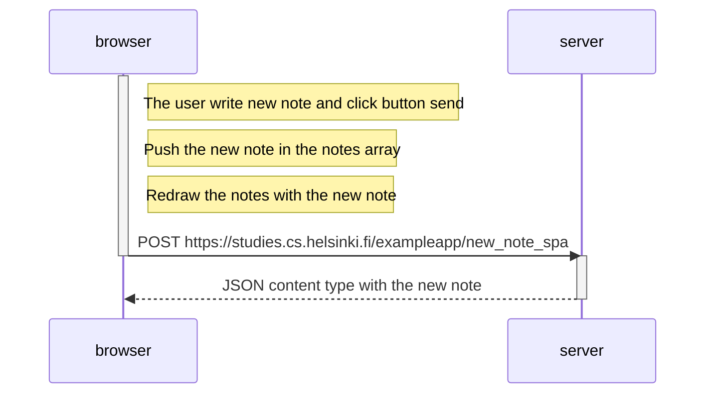

```mermaid
sequenceDiagram
    participant browser
    participant server

    activate browser
    Note right of browser: The user write new note and click button send
    Note right of browser: Push the new note in the notes array
    Note right of browser: Redraw the notes with the new note
    browser->>server: POST https://studies.cs.helsinki.fi/exampleapp/new_note_spa
    deactivate browser

    activate server
    server-->>browser: JSON content type with the new note
    deactivate server

    activate browser
```